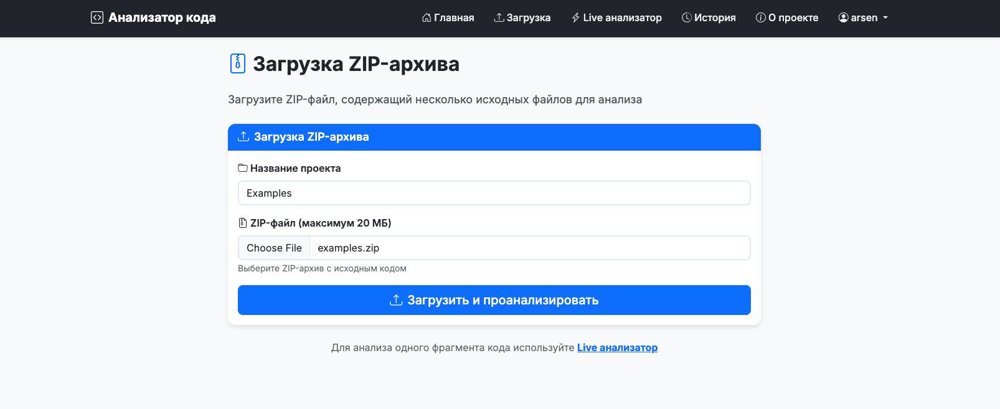
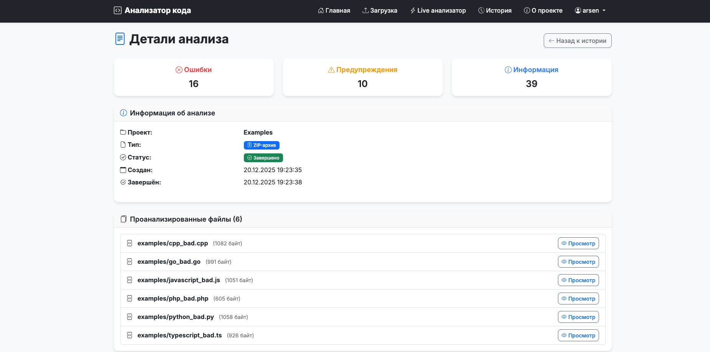
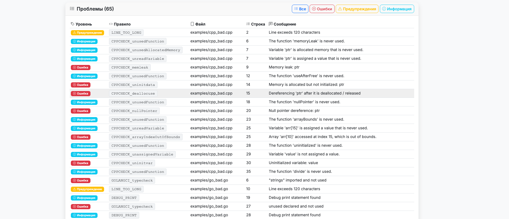
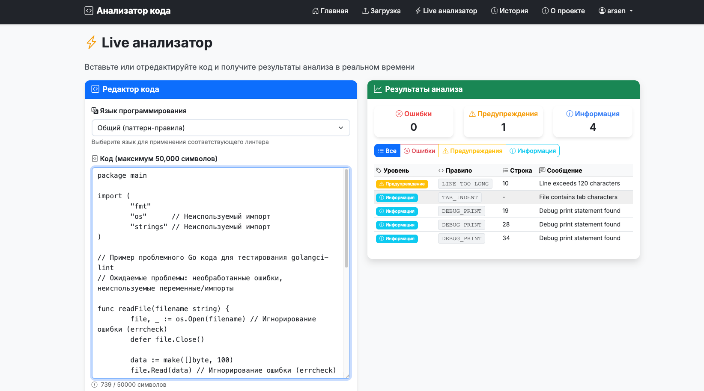
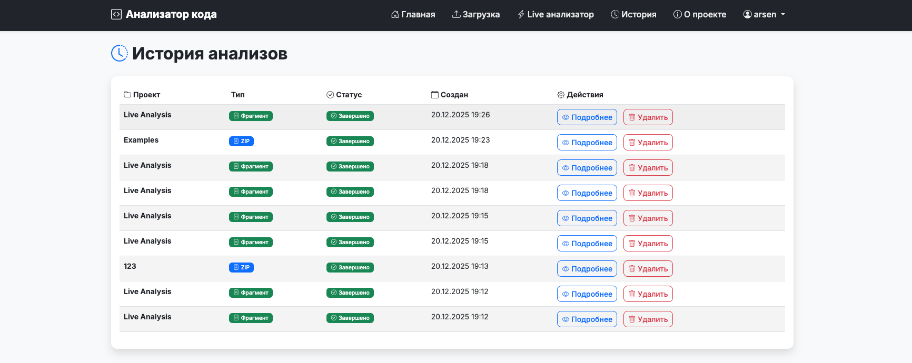

# Анализатор статического кода

Веб-сервис для статического анализа кода с поддержкой множества языков программирования и интеграцией популярных линтеров через Docker.

## Что это?

Анализатор статического кода — это веб-приложение, которое проверяет исходный код на наличие ошибок, предупреждений и потенциальных проблем. Поддерживает анализ ZIP-архивов с множеством файлов и интерактивный анализ кода в реальном времени.

## Use Cases

### 1. Анализ проекта из ZIP-архива
Загрузите ZIP-архив с вашим проектом и получите полный отчет о проблемах во всех файлах.





### 2. Быстрая проверка фрагмента кода
Вставьте код в Live анализатор и получите мгновенные результаты с возможностью выбора языка программирования.


### 3. История анализов
Просматривайте все предыдущие анализы, управляйте ими и просматривайте содержимое проанализированных файлов.


## Быстрый старт

### Запуск через Docker Compose

```bash
# Запустить все сервисы (PostgreSQL, линтеры, веб-приложение)
docker-compose up -d

# Остановка всех сервисов
docker-compose down
```

После запуска приложение будет доступно по адресу: **http://localhost:8080**

### Структура сервисов

- **webapp** (порт 8080) - Веб-приложение на Golang
- **postgres** (порт 5432) - База данных PostgreSQL
- **linters** - Docker-контейнер с линтерами для различных языков

## Поддерживаемые языки и линтеры

- **JavaScript/TypeScript** - ESLint
- **Python** - Pylint
- **Go** - golangci-lint
- **C/C++** - cppcheck
- **PHP** - PHP Syntax Checker

## Технологии

- **Backend**: Golang, PostgreSQL
- **Frontend**: HTML5, CSS3, JavaScript, Bootstrap 5
- **Архитектура**: MVC
- **Деплой**: Docker, Docker Compose
