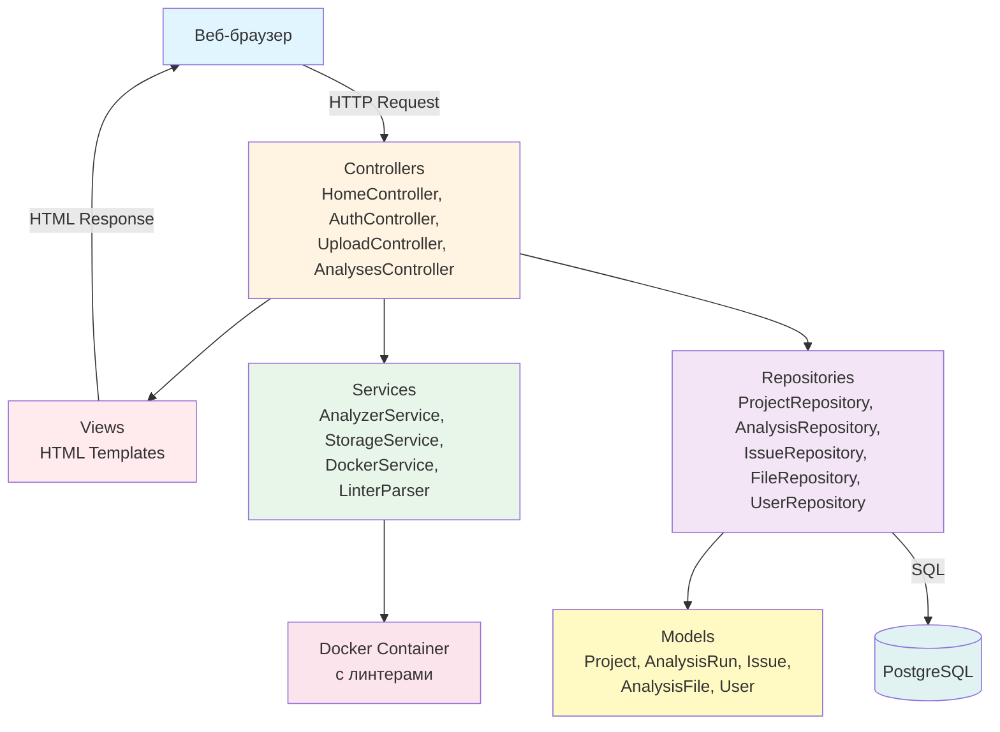

```mermaid
graph TB
    Browser[Веб-браузер]
    
    Controllers[Controllers<br/>HomeController, AuthController,<br/>UploadController, AnalysesController]
    
    Views[Views<br/>HTML Templates]
    
    Services[Services<br/>AnalyzerService, StorageService,<br/>DockerService, LinterParser]
    
    Repositories[Repositories<br/>ProjectRepository, AnalysisRepository,<br/>IssueRepository, FileRepository, UserRepository]
    
    Models[Models<br/>Project, AnalysisRun, Issue,<br/>AnalysisFile, User]
    
    PostgreSQL[(PostgreSQL)]
    DockerLinters[Docker Container<br/>с линтерами]
    
    Browser -->|HTTP Request| Controllers
    Controllers --> Views
    Views -->|HTML Response| Browser
    
    Controllers --> Services
    Controllers --> Repositories
    
    Services --> DockerLinters
    Repositories --> Models
    Repositories -->|SQL| PostgreSQL
    
    style Browser fill:#e1f5ff
    style Controllers fill:#fff4e1
    style Views fill:#ffebee
    style Services fill:#e8f5e9
    style Repositories fill:#f3e5f5
    style Models fill:#fff9c4
    style PostgreSQL fill:#e0f2f1
    style DockerLinters fill:#fce4ec
```

