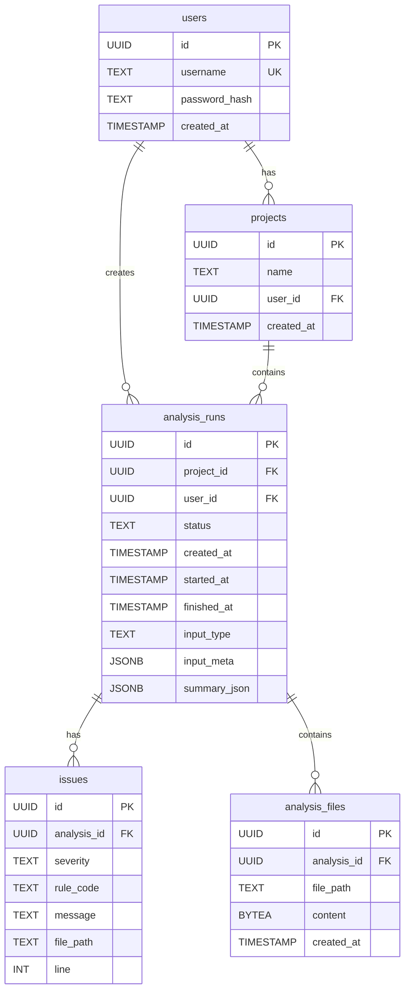

```mermaid
erDiagram
    users ||--o{ projects : "has"
    users ||--o{ analysis_runs : "creates"
    projects ||--o{ analysis_runs : "contains"
    analysis_runs ||--o{ issues : "has"
    analysis_runs ||--o{ analysis_files : "contains"
    
    users {
        UUID id PK
        TEXT username UK
        TEXT password_hash
        TIMESTAMP created_at
    }
    
    projects {
        UUID id PK
        TEXT name
        UUID user_id FK
        TIMESTAMP created_at
    }
    
    analysis_runs {
        UUID id PK
        UUID project_id FK
        UUID user_id FK
        TEXT status
        TIMESTAMP created_at
        TIMESTAMP started_at
        TIMESTAMP finished_at
        TEXT input_type
        JSONB input_meta
        JSONB summary_json
    }
    
    issues {
        UUID id PK
        UUID analysis_id FK
        TEXT severity
        TEXT rule_code
        TEXT message
        TEXT file_path
        INT line
    }
    
    analysis_files {
        UUID id PK
        UUID analysis_id FK
        TEXT file_path
        BYTEA content
        TIMESTAMP created_at
    }
```

